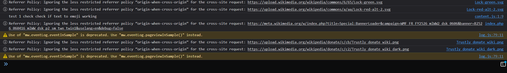

so i added manifest.json where i have basic stuff then i added a content js to check if my extension is running on other websites. click on image.png to view the console from wikipedia. Uh this is the reason why u can see my console message on wikipedia website

"content_scripts": [
{
"matches": ["<all_urls>"],
"js": ["content.js"]
}
]
